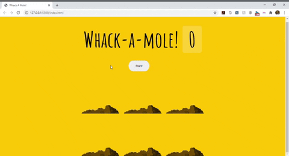

# Whack A Mole
30th day of JavaScript30 created by [Wes Bos](https://github.com/wesbos).

### 🛠 Tools:
- JavaScript
- HTML5
- CSS3

  

### Test

You can access [here](https://whacka-game.netlify.app/) (is not responsive yet)

### Author
---
 
  
 <b>Gustavo Goulart</b>

Let's keep in touch! 👋🏽

  
